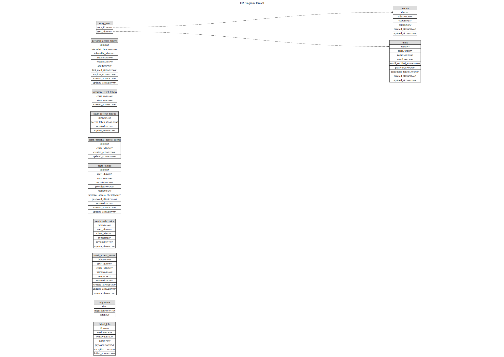

# Kontinentalist Full-stack Engineer Test - Backend

## Framework & Library

- PHP Framework: [Laravel 10](https://laravel.com/docs/10.x)
- Authentication library: [Laravel Passport](https://laravel.com/docs/10.x/passport)
- Container Management: [Docker](https://www.docker.com/) & [Docker Compose](https://docs.docker.com/compose/)
- Testing Library: [Laravel Built-in PHPUnit](https://laravel.com/docs/10.x/testing)

## Description
Providing API service for the [Frontend](https://github.com/alvintheodora/kontinentalist-story-vue)
- Route:
    - **API**, all routes are prefixed with `/api`
        - `POST /login` to login
        - `GET /stories` to retrieve story list
        - `GET /story/{id}`  to retrieve a single story.
        - `POST /story` to create a story.
        - `PATCH /story/{id}` to update a story.
        - `DELETE /story/{id}` to delete a story.
        - `GET /me` to retrieve current logged in user.
        - `GET /users` to retrieve user list.
- Authentication and Token Scope Authorization using [Laravel Passport](https://laravel.com/docs/10.x/passport) with OAuth2 Personal Access Token method to simplify the implementation. For further development and production, it should follow the best practice of which OAuth2 grant we should choose, reference: [Recommended Grant Type](https://oauth2.thephpleague.com/authorization-server/which-grant/)
- Fresh installation will have a database seeder that populates table users, stories, and their pivot table.
- Feature tests are also implemented using Laravel Built-in PHPUnit, and are located in folder `tests/Feature/`. Kindly refer to the Setup - Development - Scripts section on how to run it.

## ERD


## API Documentation
Postman collection and Postman environment are available in folder `postman`. For the `{{ access_token }}` environment, you could set it by accessing the login API and copy the access_token in the response to your local postman environment menu.

## Requirement
* [Docker](https://docs.docker.com/install/)
* [Docker Compose](https://docs.docker.com/compose/install/)

## Setup - Development

### **1. Clone the repository**

```bash
git clone https://github.com/alvintheodora/kontinentalist-story.git
cd kontinentalist-story
```

### **2. Scripts**

- `bash generate.sh` -> for first time installing and starting docker containers
- `bash start.sh` -> for starting docker containers on second time and so on 
- `bash stop.sh` -> for stopping running containers without removing them
- `bash test.sh` -> for running the Testing, using Laravel Built-in PHPUnit.

Then API requests will be available on [http://localhost:8080/](http://localhost:8080/)
